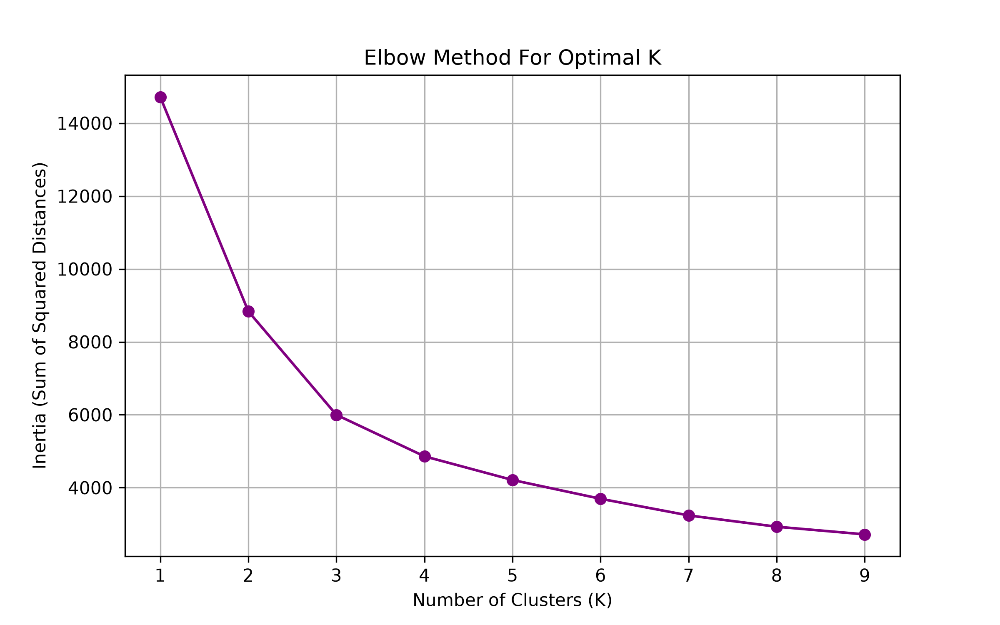
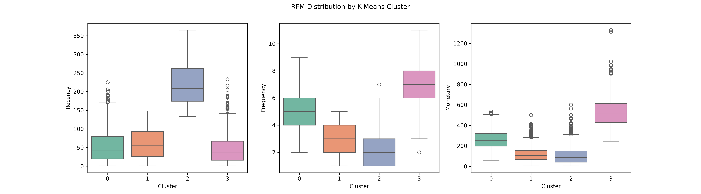
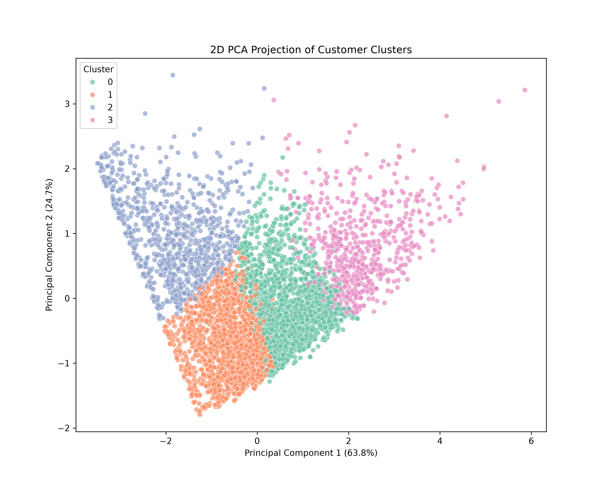
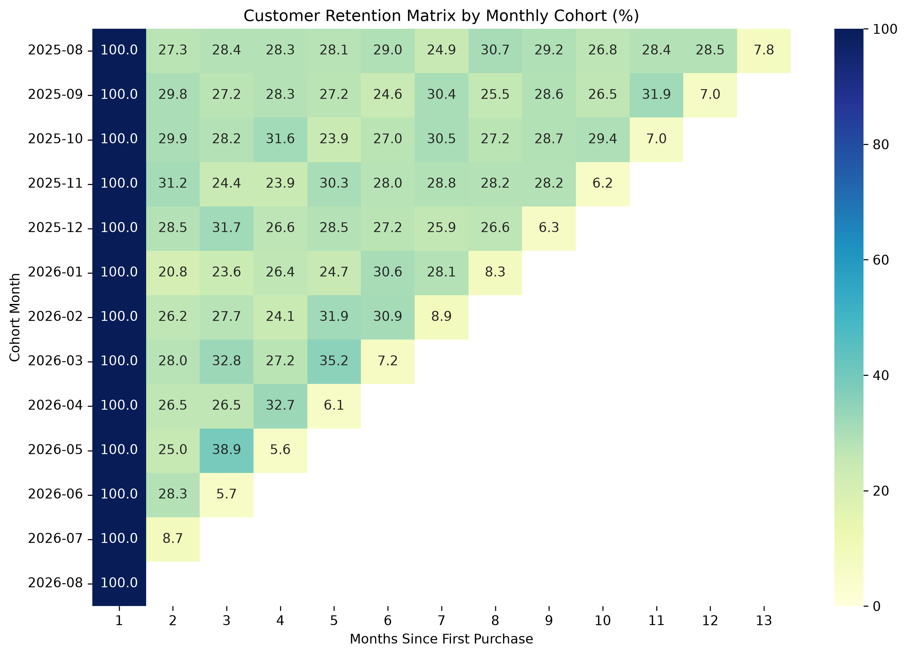
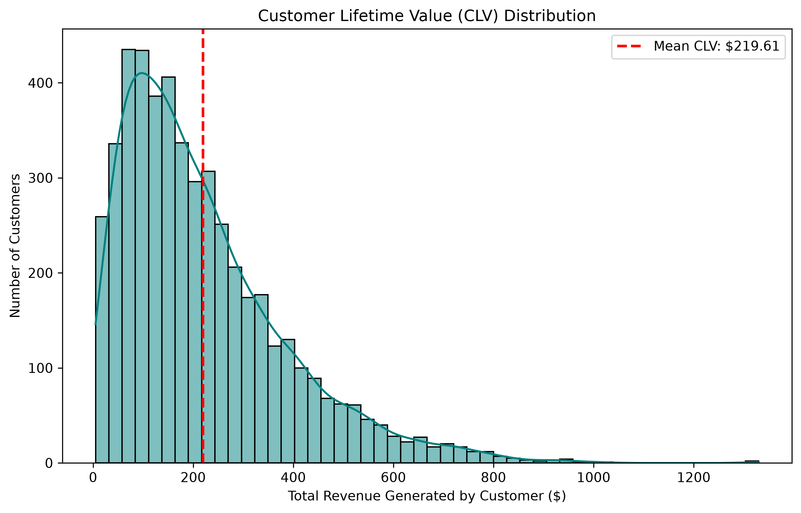
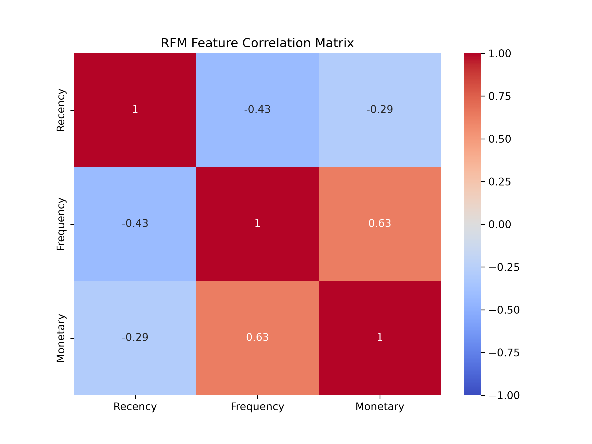
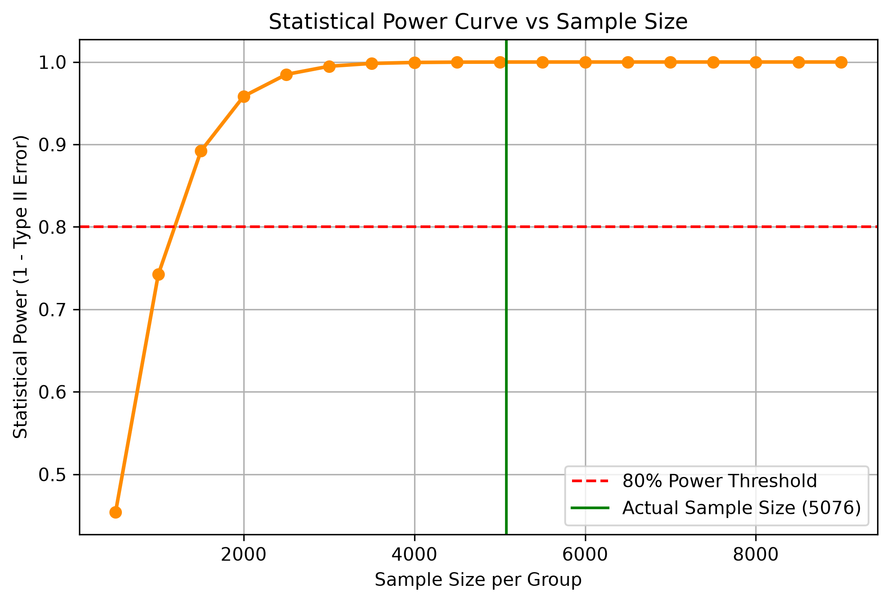
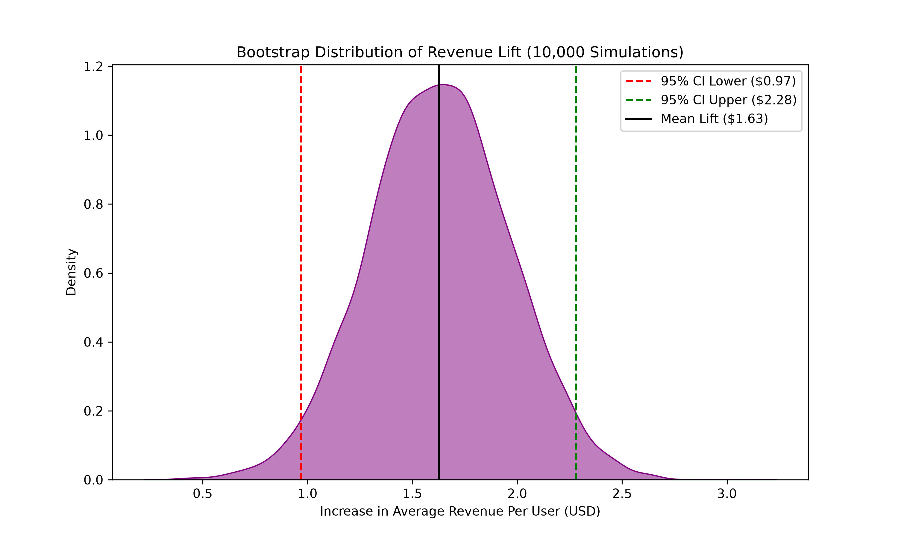

# 📊 Advanced Data Science: Unsupervised Learning & Statistical Simulation

Welcome to my Data Science project! My name is **Farhan Ahmad Ansari**, and I built this repository to showcase advanced Unsupervised Machine Learning, Dimensionality Reduction, and Statistical Simulations.

While my other projects focus on predictive AI (Machine Learning and Deep Learning), this project proves my ability to discover hidden patterns in raw data and prove business value using rigorous statistical math.

## 💡 The Architecture & Results

This project simulates a massive E-commerce environment and processes it using the following advanced pipeline:

### 1. Unsupervised Machine Learning (K-Means)
Instead of relying on human bias to group customers, I used **K-Means Clustering** to algorithmically discover distinct behavioral segments based on Recency, Frequency, and Monetary (RFM) features. I used the mathematical **Elbow Method** to determine the optimal number of clusters.




### 2. Dimensionality Reduction (PCA)
To visualize high-dimensional customer behavior, I implemented **Principal Component Analysis (PCA)** to reduce the feature space and plot the K-Means clusters in a 2D projection. This mathematically proves how distinct the groups are.



### 3. Advanced Cohort Analysis & CLV
I computed a **Customer Retention Heatmap**, tracking the percentage drop-off of customers month-over-month. I also analyzed the **Customer Lifetime Value (CLV)** distribution across the entire user base.





### 4. A/B Testing via Bootstrapping & Power Analysis
Instead of just calculating a simple p-value via a T-Test, I implemented **Monte Carlo Bootstrapping**. By simulating 10,000 alternative realities of an A/B test, I calculated the **95% Confidence Interval** for the exact revenue lift caused by a UI redesign. I also performed a **Statistical Power Analysis** to prove my sample size was large enough to avoid False Negatives.

**Results:**
- **Mean Revenue Lift:** $1.63 per user
- **95% Confidence Interval:** [$0.97, $2.28] (Statistically Significant)




## 📂 Project Structure

- `scripts/1_generate_data.py`: Simulates 20,000 raw E-commerce transactions and 10,000 A/B test logs.
- `scripts/2_run_etl.py`: The ETL pipeline that cleans data and computes raw RFM vectors.
- `scripts/3_customer_clustering.py`: Executes K-Means, PCA, and Correlation Matrices.
- `scripts/4_cohort_analysis.py`: Computes the Retention Heatmap and CLV distributions.
- `scripts/5_ab_test_bootstrapping.py`: Runs 10k simulations and Power Analysis.
- `requirements.txt`: Python dependencies (scikit-learn, seaborn, scipy).

## 🚀 How to Run Locally

1. Install the required libraries:
   ```bash
   pip install -r requirements.txt
   ```
2. Execute the entire pipeline automatically:
   ```bash
   ./run_pipeline.sh
   ```

---
*Created by Farhan Ahmad Ansari.*
